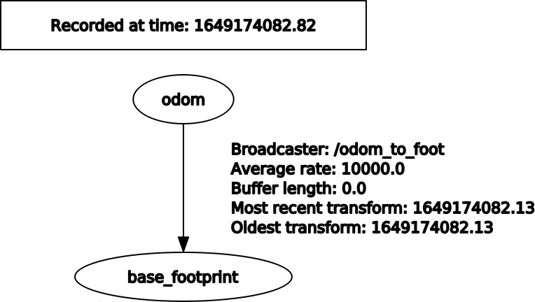

# simple_odom
sets up robot odometry only using cmd_vel ONLY TO BE USED WITH INITIAL TESTING AND DEBUGGING

Node : cmd_vel2_odom simply integrates the command_velocities to estimate the location of the robot
subcribes:
"/cmd_vel" Geometry_msgs::Twist 
Publishes:
"/odom" nav_msgs::Odometry

Node : odom_to_foot, reads in Odometry topic and publishes Odometry tf frame
subscribes: 
"/odom" nam_msgs::Odometry
broadcasts:
TF from "/odom" to "/base_footprint"

 
 
 tf tree
 
  
