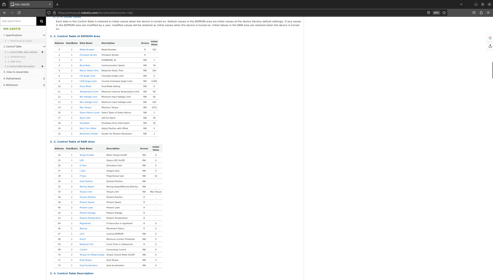
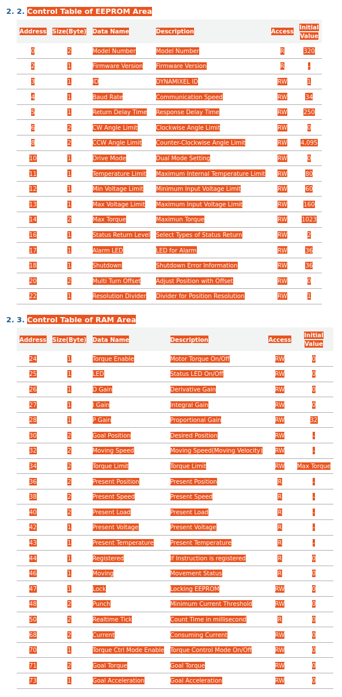

# dynamixel_lib

Message [Nate Adkins](mailto:npa00003@mix.wvu.edu) on Slack with any questions or suggestions

## Overview

This Python library facilitates the control of Dynamixel motors using the Dynamixel SDK within a Python environment. The library introduces two key classes: `U2D2` and `Dynamixel`. The `U2D2` class manages communication ports, ensuring unique device paths, while the `Dynamixel` class represents individual Dynamixel motors, ensuring unique motor IDs.

## Classes

### U2D2 Class

The `U2D2` class manages communication with Dynamixel motors and ensures unique device paths. It provides a way to establish a connection to a Dynamixel motor. The `U2D2` class corresponds to the actual physical hardware device plugged into a usb port.

### Dynamixel Class

The `Dynamixel` class represents an individual Dynamixel motor. It ensures that new instances of the class do not have repeated motor IDs. The `Dynamixel` class requires an id and an instance of a `U2D2` controller

### MX28 Class

### MX64 Class 

### MX106 Class 

### XL430 Class 

### _DynamixelModel Class

The `_DynamixelModel` class is inherited by specific dynamixel models (listed above). This class is the base class for the automatically generated dynamixel models that allows for proper reading and writing of data. This class is not directly used and should not be accessed.

## Installation 

### 1. Clone this repository
- ```bash
  git clone git@github.com:wvu-urc/dynamixel_lib.git
  ```
### 2. Navigate to the repository directory 
- ```bash
  cd dynamixel_lib
  ```
### 3. Install the dynamixel SDK 
- ```bash 
  ./install_dynamixel_sdk.bash
  ```
- refer to the [dynamixel SDK documentation](https://emanual.robotis.com/docs/en/software/dynamixel/dynamixel_sdk/overview/) if any problems occur

## Example usage

```python
from dynamixel_lib import Dynamixel, U2D2
from dynamixel_lib import MX106

    def test_motor(motor_id: int):
        
        u2d2 = U2D2('/dev/u2d2',3000000)
        motor = Dynamixel(MX106,motor_id,u2d2)
        
        motor.write(MX106.TorqueEnable,1)

        for x in range(5):
            for n in range(300):
                motor.write(MX106.GoalVelocity,n)
            motor.write(MX106.GoalVelocity,0)

        motor.write(MX106.TorqueEnable,0)

    test_motor()
```

## How to add support for new motor models:
- This library has been written so that any model of dynamixel will be easily supported.
- Navigate to [dynamixel_lib/generate_model_classes/model_ctrl_tables](dynamixel_lib/generate_model_classes/model_ctrl_tables)
- There is a .csv file for the MX106 that contains control table values copied from the [robotis emanual for the MX106 model](https://emanual.robotis.com/docs/en/dxl/mx/mx-106/)
- The dynamixel MX106 and XL430 have been implemented first due to their prevelance of use in the lab.
- Below are steps to support additional models of dynamixel motors 

### Steps to copy a new control table:
1.  Go to [robotis emanual for the dynamixels](https://emanual.robotis.com/docs/en/dxl)
2.  Select the new model you want to add to the library
  
3. Navigate to the control table for the new model
  
4. Copy the control table values
  
  **(Be sure to include the EEPROM Area and RAM Area Headers)**
5. Open LibreOffice Calc
6. Select the cell "A1"
7. Paste the values into the sheet and maintain the formatting of the pasted text 
8. Select "File" -> "Save As" 
9. Select "Text CSV (.csv)" as the file type in the bottom right corner
10. Select "dynamixel_lib/generate_ctrl_table_vals/model_ctrl_tables" as the save path
11. Change the name of the .csv file to match the name of the motor model. The name of the .csv file will match the name of the python model class that will be generated in step 11.
12. Click "Save"
13. A popup will ask you to confirm the file format. Select "Use Text CSV Format".
14. Another popup will ask you to selext field options. Set the String delimiter to be blank, then select "OK"
12. Now that the .csv file is in the correct format and in the right location, we can generate and add the python class to the existing classes. 
13. Run the [generate_model_classes.py](dynamixel_lib/generate_model_classes/generate_model_classes.py) file. This will read through the .csv files (including the one you just added), and generate the model classes. 
14. You can now import and utilize the model class!