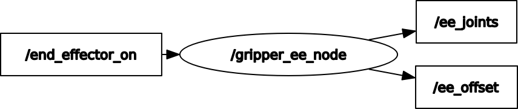

# gripper_ee
provides ros interfaces for a gripper style end effector

/end_effector_on : type : std_msgs::Bool, where true = closed, false = open  

/ee_joints : type : sensor_msgs::Joint_State, houses all the end-effector joint angles 

/ee_offset : type : geometry_msgs::Pose, the x,y,z offset from the last link on the wrist to the actuation location of the end effector
