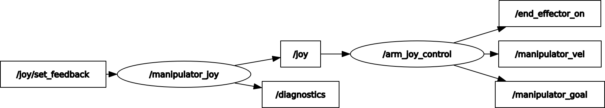

# manipulator_teleop
converts /joy to a 3d /cmd_vel and /pose for manipulator teleop control using logitec controller

"/end_effector_on" std_msgs::Bool indicates to activate the end effector
"/manipulator_vel" geometry_msgs::Twist 3d velocity (direction and orientation) command
"/manipulator_goal" geometry_msgs::Pose position and orientation goal for the manipulator

