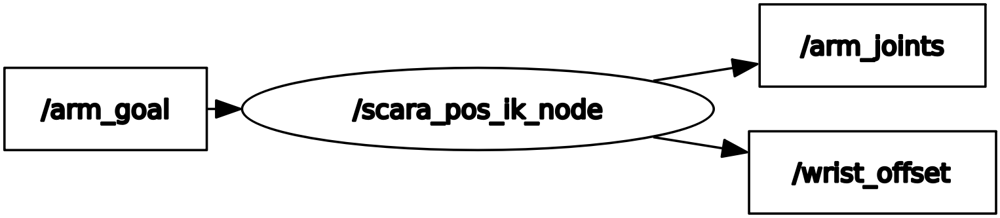

# scara_arm_ik
holds geometric inverse kinematics for scara arm configuration

Description: This node is used for POSITION INVERSE KINEMATICS of a standard SCARA arm. Where the first joint is a prismatic lift, the second a rotary joint whose
                axis is parallel to the lift, and a third joint that is rotary who is also parallel to the lift.  
   
  

Subcribes to:  
"/arm_goal" of type Geometry_msgs::Pose and matches the provided XYZ position  
  
Publishes to:  
"/wrist_offset" of type Geometry_msgs::Pose which contains the orientation offset of the wrist orientation goal  
"/arm_joints" of type Sensor_msgs::Joint_State which contains the joint angles of the arm motors "lift, shoulder, elbow"
