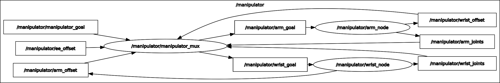

# simple_manipulation_goal
used to have a manipulator go to a specific goal position, by fusing the arm, wrist, and end effector inverse kinematics and offsets  

NOTE: this node requires the useage of a seperate arm inverse kinematics node "arm_node" and wrist inverse kinematics node "wrist_node" using the interface of:  

Subscribes to:  
"goal" of type Geometry_msgs::Pose which is the target goal for the arm or wrist  

Publishes to:  
"joints" of type Sensor_msgs::Joint_State which has the IK solution joint angles  
"offset" of type Geometry_msgs::Pose which is how this node's solution affects the other mechancial device's goal  

 

Subcribes to:      
"/manipulator_goal" of type Geometry_msgs::Pose and matches the provided XYZ position and XYZW orientation  
"/ee_offset" of type Geometry_msgs::Pose and is the XYZ position offset of the end effector tip in the wrist's last frame  
    
Publishes to:    
"/manipulator_joints" of type Sensor_msgs::Joint_State which contains the joint angles of the arm and wrist motors in that order  

NOTE: this node works by taking advantage of ROS's topics to perform solution itterations, and is therefore inherently slow. Thus it should only be used when prototyping arms and wrists, since it was programmed for modularity over speed.   
